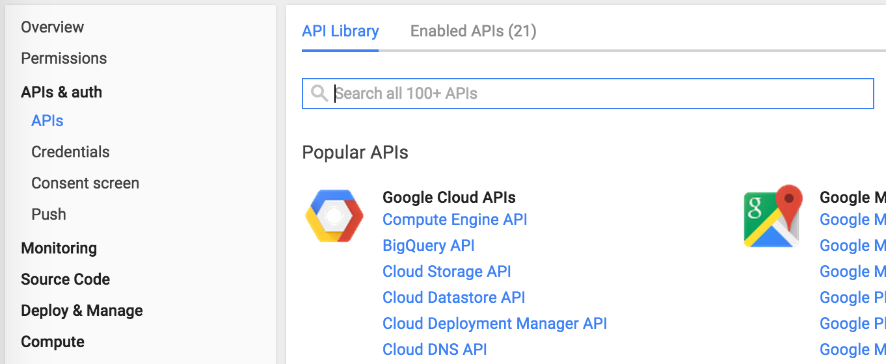
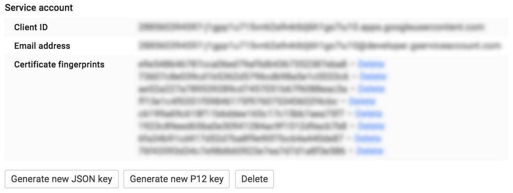
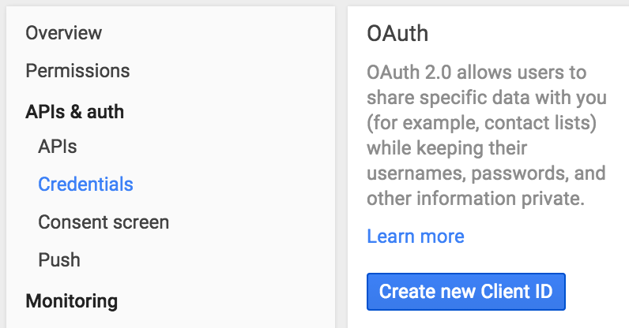
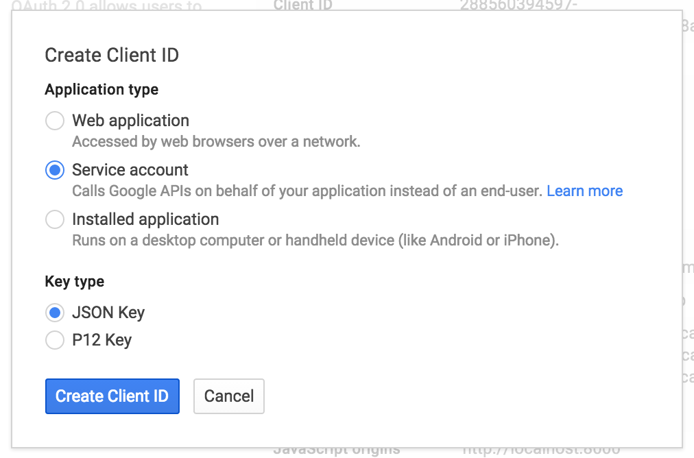

# Authorization

It's easy to get authorized and start using Google's APIs. You can set your credentials on a global basis as well as on a per-API basis.

## On Google Compute Engine

If you are running this client on Google Compute Engine, we handle authorization for you with no configuration. Just be sure when you [set up the GCE instance][gce-how-to], you add the correct scopes for the APIs you want to access.

  * **BigQuery**
    * `https://www.googleapis.com/auth/bigquery`
  * **Datastore**
    * `https://www.googleapis.com/auth/datastore`
    * `https://www.googleapis.com/auth/userinfo.email`
  * **Pub/Sub**
    * `https://www.googleapis.com/auth/pubsub`
    * `https://www.googleapis.com/auth/cloud-platform`
  * **Search**
    * `https://www.googleapis.com/auth/cloud-platform`
    * `https://www.googleapis.com/auth/cloudsearch`
    * `https://www.googleapis.com/auth/userinfo.email`
  * **Storage**
    * `https://www.googleapis.com/auth/devstorage.full_control`

## On Your Own Server

If you are not running this client on Google Compute Engine, you need a Google Developers service account. To create a service account:

  1. Visit the [Google Developers Console][dev-console].

  1. Create a new project or click on an existing project.

  1. Navigate to **APIs & auth** > **APIs** and enable the APIs that your application requires.

    

    *Note: You may need to enable billing in order to use these services.*

    * **BigQuery**
      * BigQuery API
    * **Datastore**
      * Google Cloud Datastore API
    * **Pub/Sub**
      * Google Cloud Pub/Sub
    * **Search**
      * Google Cloud Search API
    * **Storage**
      * Google Cloud Storage
      * Google Cloud Storage JSON API

  1. Navigate to **APIs & auth** > **Credentials**.

    If you already have a service account, you can easily generate a new key file. If you don't have a service account, skip down to *[Create a new service account](#create-a-new-service-account)*.

    ###### Re-use an existing service account

    Click on **Generate new JSON key**:

    

    ###### Create a new service account

    Click on **Create new Client ID**:

    

    Select **Service account**:

    

    After the account is created, you will be prompted to download the JSON key file that the library uses to authorize your requests.

[dev-console]: https://console.developers.google.com/project
[gce-how-to]: https://cloud.google.com/compute/docs/authentication#using
